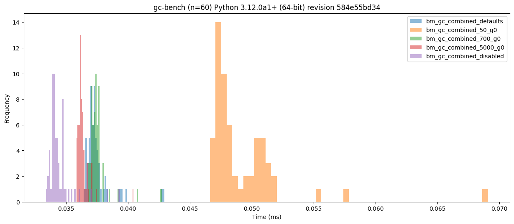
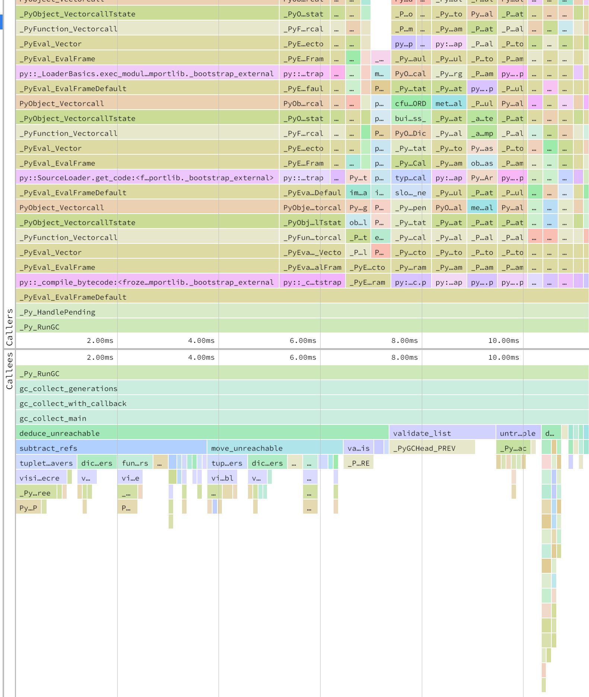

# Idea

## Results

Disabled GC shows better performance:



## Process

Stage 1 will create a tree using the builtin dict structure.

```json
{0: 0.0,
 1: 0,
 2: [],
 3: {4: None,
     5: (),
     6: 0.0,
     7: 0,
     8: [],
     9: {10: None,
         11: (),
         12: 0.0,
         13: 0,
         14: [],
         15: {16: None,
              17: (),
              18: 0.0,
              19: 0,
              20: [],
    ...
}
```

Stage 2 will go through and for each item in the tree, add it to a list using `(k, v)` as the value.

Stage 3 will traverse the tree and add the `all_items` list to every list in the tree (creating a recursive reference):

```json
{0: 0.0,
 1: 0,
 2: [[(0, 0.0),
      (1, 0),
      (2, <Recursion on list with id=4466297424>),
      (3, {4: None, 5: (), 6: 0.0, 7: 0, 8: [...], 9: {...}}),
      (4, None),
      (5, ()),
      (6, 0.0),
      (7, 0),
      (8, [[...]]),
      (9, {10: None, 11: (), 12: 0.0, 13: 0, 14: [...], 15: {...}}),
      (10, None),
      (11, ()),
      (12, 0.0),
      (13, 0),
      (14, [[...]]),
      (15, {16: None, 17: (), 18: 0.0, 19: 0, 20: [...], 21: {...}}),
      (16, None),
      (17, ()),
      (18, 0.0),
      (19, 0),
      (20, [[...]]),
```

Stage 4 will then go through and reverse the process of stage 3:

```json
{0: 0.0,
 1: 0,
 2: [],
 3: {4: None,
     5: (),
     6: 0.0,
     7: 0,
     8: [],
     9: {10: None,
         11: (),
         12: 0.0,
         13: 0,
         14: [],
         15: {16: None,
              17: (),
              18: 0.0,
              19: 0,
              20: [],
              21: {22: None, 23: (), 24: 0.0, 25: 0, 26: [], 27: {...}}}}}}
```

Stage 5 will go traverse through the tree and delete keys that have dictionaries as values.

Lastly, `all_items` is cleared and then `root` is deleted.

## Executing profilers

```console
$ PYTHONPERFSUPPORT=1 perf record -F 9999 -g -o perf.data python bm_gc_combined.py
$ perf script -F +pid > prof.txt
```

You can then use something like speedscope (`npm install -g speedscope`) to analyse the call-stack for `_Py_RunGC`:

